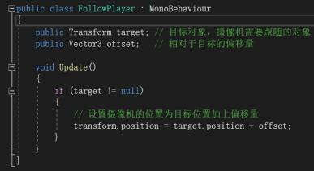
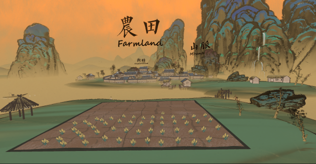
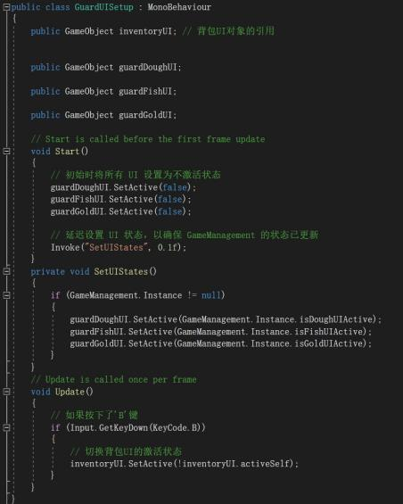

# Creative Making: MSc Advanced Project - Beyond the Mountain Blog

Github Link: https://github.com/22015680/Creative-Making-MSc-Advanced-Project  

Video Link: https://www.youtube.com/watch?v=lh29TvXH9tU&t=4s  

Game Download Link: https://idealismfive.itch.io/beyond-the-mountain  

## Introduction
Beyond the Mountain is an adventure puzzle game themed around nihilism, combining Chinese ink painting style with modern game design concepts to create a unique gaming experience. This project aims to explore the disappointment and self-discovery in an individual's quest for meaning. Through six interrelated game levels, it portrays the protagonist's emotional journey through different stages of life.

## Phase 1: Research and Conceptualization
When I first started contemplating this project, what immediately sprang to mind was Chinese culture and art. Being Chinese myself, this venture represents a journey of cultural roots discovery and a process of self-identity affirmation, as well as an excellent method for cultural dissemination. Besides Chinese culture, the philosophical themes that particularly captivate me are existentialism and nihilism, and integrating these with Chinese cultural elements helped narrow down my research scope.  

In my exploration of nihilistic philosophy, I became intrigued by its manifestation in modern Chinese literature. This led me to focus on contemporary poet Wang Jiaxin's Beyond the Mountain, and also reminded me of Su Shi's Written on the Wall of West Forest Temple. Although Su Shi's poem originally intended to convey the idea that understanding the true nature and entirety of things requires transcending narrow confines and subjective biases, the line “only because I am in this mountain” from his poem offers an epiphanic realization, thereby establishing the mountain as a central theme.  

The philosophical contemplation of nihilism further extended to the theme of dystopia. Reflecting on literary works with dystopian themes in Chinese history, I was naturally drawn to Tao Yuanming's The Peach Blossom Spring. Thus, the game’s narrative setting was tentatively determined—a utopia during China’s Wei, Jin, Southern and Northern Dynasties, named The Peach Blossom Spring. Following this backdrop, I conducted detailed research: delving deeply into nihilism, with a focus on the sentiments of disillusionment expressed in Beyond the Mountain and The Peach Blossom Spring. By reading related philosophical literature, I analyzed the manifestations and impacts of nihilism in social life. As my intention was to develop a game, I also researched game design methodologies, such as reading books like The Art of Game Design and Rules of Play: Game Design Fundamentals, drawing knowledge in game planning and arrangement. Given that narrative-driven games can better convey themes of nihilism, I particularly focused on studying the design of puzzle games, creating puzzle levels to guide the plot development. Therefore, I researched puzzle and narrative games like Rusty Lake, Detroit: Become Human, and What Remains of Edith Finch, learning about their narrative structures and puzzle designs.  

Beyond the design of the game levels, artistic style and musical effects are also crucial components of the game. Hence, I studied the Chinese ink painting style and thoroughly explored how to integrate it into the visual design of a modern game, creating a unique artistic style for the game. Additionally, I researched sounds from traditional Chinese musical instruments like the Guqin, ingeniously integrating them into the game.  

   
  Brainstorming

  

## Phase Two: Artistic and Music Design and Asset Creation  

First, I researched the traditional art form of Chinese ink painting. There are four unique aspects of this art style. One of the most distinctive features of ink painting is its use of ink shades. The art predominantly relies on the depth and intensity of ink to express images and emotions, using minimal colors. Artists skillfully employ variations in ink shades to depict light, shadow, and texture. The second unique aspect is its lines. Different brush strokes and line qualities convey various textures and movements. Artists use varied brush techniques like stippling, smearing, and washing to represent the form and texture of objects. The third unique aspect is the concept of 'leaving blank spaces', which is not about filling the entire canvas but using intentional blank spaces to create a sense of depth and vastness, imbued with poetic and philosophical meaning. This approach reflects the Chinese philosophical idea of 'the coexistence of void and reality'. The fourth aspect is harmony of motion and stillness. A common feature in ink painting is the harmonious coexistence of dynamic and static elements. For instance, a painting might juxtapose the stillness of mountains against the motion of flowing water, creating a combined sense of movement and tranquility.  

   
  Thousand Miles of Rivers and Mountains by Wang Ximeng of the Northern Song Dynasty

    

After researching the art style, I had been actively searching for art resources and assets online that align with the ink painting style. I had been meticulously selecting materials that not only resonate with my game's theme but also complement its aesthetic style. Finally, I found a 3D scene that meets the requirements, which was made by Mamenr on Bilibili.com.  

   
  3D Scene Made by Mamenr on Bilibili.com

   

For the level design, I then created custom game assets based on the art style of Chinese ink painting. This includes original character designs, environmental elements, and interface components. I was committed to ensuring that every element harmoniously blends with the ink painting style and the overarching theme of our game. This phase is crucial in bringing my artistic vision to life, as it allows me to infuse traditional artistry into the interactive realm of game design.  

   
  Art Assets Created by Myself

   

In addition to the visual and gameplay elements, I've delved into identifying the most fitting musical style for my game. My search led me to the ancient and classically Chinese instrument, the Guqin. The Guqin, with its pentatonic scale of Gong, Shang, Jue, Zhi, and Yu, captures the essence of traditional Chinese music and its historical context more profoundly than the more modern Guzheng.  

After much consideration, I've selected two renowned pieces that resonate with my game's theme. The first is the legendary Guangling San, a piece that embodies the depth and complexity of Chinese classical music. The second is Zhuang Zhou Meng Die, a piece that profoundly reflects the themes of nihilism and transcendent thought. These selections not only enhance the game's ambiance but also align seamlessly with its narrative and philosophical undertones.  

## Phase 3: Level Construction and Coding  

My game comprises six levels and one main scene, each meticulously crafted to mirror the protagonist's monotonous, day-to-day life. This repetitive cycle not only reflects the mundane aspects of her existence but also sets the stage for her deep longing to discover what lies beyond the mountains. This yearning is a driving force in the game, propelling her to overcome numerous challenges and obstacles to ascend the towering peaks. However, upon reaching the summit, she's met with the revelation that beyond the mountain lies yet another mountain, a poignant moment that encapsulates the theme of nihilism in our narrative.  

My game comprises six levels and one main scene, each meticulously crafted to mirror the protagonist's monotonous, day-to-day life. This repetitive cycle not only reflects the mundane aspects of her existence but also sets the stage for her deep longing to discover what lies beyond the mountains. This yearning is a driving force in the game, propelling her to overcome numerous challenges and obstacles to ascend the towering peaks. However, upon reaching the summit, she's met with the revelation that beyond the mountain lies yet another mountain, a poignant moment that encapsulates the theme of nihilism in our narrative.  

### Level One: Home  

This level depicts the warmth and confinement of protagonist's family life, with dialogues and animation sequences to enrich the narrative.
The main challenge I encountered was managing the video playback and the logic for progressing through dialogues. Balancing the technical aspects of media integration with the storytelling flow proved to be a crucial part of this level's design process.  

<table>
  <tr>
    <td align="center">
       
      Background of Level One
    </td>
    <td align="center">
       
      Part of the Code of Level One
    </td>
  </tr>
</table>   

### Level Two: School  

In the school scene, I've introduced a multiple-choice question-answer level to test the player's judgment and knowledge. This design choice aims to immerse players in the protagonist's world, letting them experience the tension of a pop quiz and the overall ambience of school life alongside the main character. An essential aspect of this level is the different feedback messages that result from the player's choices. Selecting an incorrect answer leads to negative consequences, such as an angry teacher's image and words, while a correct answer results in praise from the teacher. The challenge in this level lies in crafting the logic behind the choices and dialogues, ensuring they are coherent and contribute meaningfully to the gameplay and narrative, while also effectively conveying the impact of the player's decisions on the game's progression.  

<table>
  <tr>
    <td align="center">
       
      Background of Level Two
    </td>
    <td align="center">
       
      Part of Code of Level Two
    </td>
  </tr>
</table>   

### Level Three: Farming Activities  

In this level, I've designed a labyrinth-themed puzzle centered around watering crops. The protagonist must navigate and solve the maze to access water for irrigating the fields. This design metaphorically represents the confusion and exploration individuals often encounter in life. Upon completing this level, the main scene undergoes a transformation as rice appears, providing players with positive feedback and a sense of accomplishment for having completed the task. The primary challenge I faced in this level was managing scene transitions, particularly adjusting the protagonist's movements and the camera's following logic to ensure seamless gameplay while effectively conveying the impact of the player's actions on the game's environment and progression.  

<table>
  <tr>
    <td align="center">
       
      Maze
    </td>
    <td align="center">
       
      Water God(Player of Level 3)
    </td>
    <td align="center">
       
       
      Part of Code of Level 3
    </td>
  </tr>
</table>   

### Main Scene: Level Transitions, Scene Changes, and the Backpack System  

The primary level is set in a mountain village, which serves as the protagonist's hometown. Here, the protagonist explores to find interactive items and access other levels. This main level houses the core logic for scene transitions. For example, interacting with certain items in the scene can lead to a transition to another level. After completing a level, players can witness changes in the scene and acquire new items. These items can then be viewed and managed within the backpack system, a key feature that enhances the gameplay experience.  

<table>
  <tr>
    <td align="center">
       
      Main Scene
    </td>
    <td align="center">
       
       
      Part of Code of Main Scene
    </td>
  </tr>
</table>   

### Level Four: Fishing  

In this level, players are tasked with fishing activities, which involve interaction with a fishing rod. This is executed through a user interface that requires clicking and dragging. A key aspect of this level is the discovery of coins inside the fish's mouth – a critical item for progressing in the game. These coins are essential for negotiating with the guard to access the mountain climbing level, thereby testing the player's observation and exploration skills. In designing this level, I paid homage to the fishing challenge in Cube Escape: Rusty Lake. The primary coding challenges here were related to the backpack system and the item dragging mechanics.  

<table>
  <tr>
    <td align="center">
       
      Main Scene
    </td>
    <td align="center">
       
      Part of Code of Main Scene
    </td>
  </tr>
</table> 
